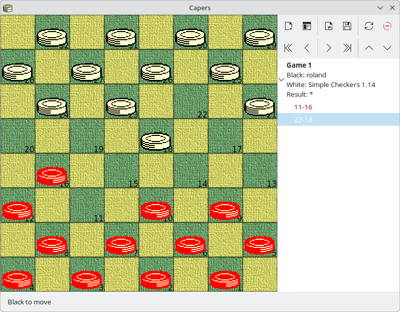

# Capers

Play checkers against the computer and study draughts games from books.

Please see original [README](README.txt) for more information.

The `pygobject` branch is a new version of the game, ported to Python 3 and PyGObject by [Claude AI](https://claude.ai).

## Screenshot

